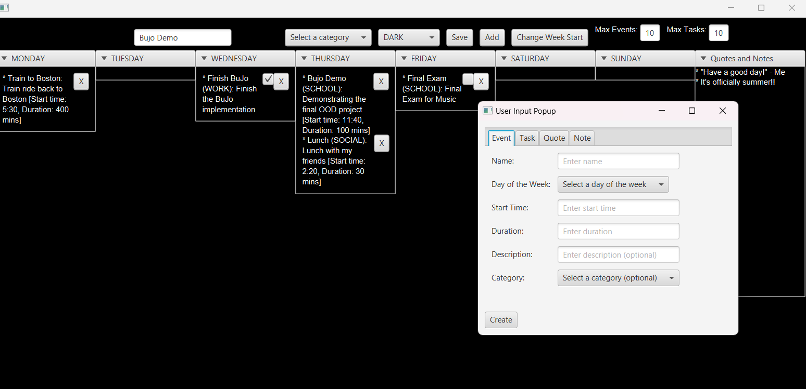

# 3500 PA05 Project Repo

[PA Write Up](https://markefontenot.notion.site/PA-05-8263d28a81a7473d8372c6579abd6481)

README

# Welcome to D.E.A Journal!!

## Pitch
D.E.A. Journal is a state-of-the-art digital Bullet Journal creation software that allows the user to create a customizable Bullet Journal for their organizational needs. After being displayed a splash screen, the user is then prompted to type in a password to ensure their Bullet Journals are secure. The user then chooses to create a new file, which can be named and is created based on a static template, or choose to open a file from a dropdown of saved files. Upon creating/opening a file, the user sees the Bullet Journal, which either starts as a blank template if the user created a new file, or starts with whatever previously saved changes are on a file if the user opens an existing file. From there, the user can see a week view, containing a display for each day of the week, as well as a display for “Quotes and Notes.” The user can press the “Add” button to create a new Event or Task to be placed on any day of the week, as well as a Quote or a Note to be placed in the “Quotes and Notes” display. Additionally, Tasks and Events can be deleted with a delete button corresponding to each one, and Tasks can be checked as completed or not with a corresponding check box. Users can enter the name of the week, along with the maximum Events and Tasks allowed during a given day each week, which will cause warnings to be displayed when the user surpasses one of those numbers. Users can choose to display Tasks and Events of a certain category, change the start of the week between Monday or Sunday, and change the theme of the Bullet Journal. The user can choose between three preset themes which change the background color, text color, and text font, or they can choose to create a custom theme, which opens a display that allows them to choose these three components themselves. When the user is done, they can click the “Save” button. If the user started the Bullet Journal by creating a new file, then the new file will be created and the information on the journal will be saved, allowing them to open the file upon restarting the application without changing the template. If the user started the Bullet Journal by opening an existing file, then the file will be updated with changes made in the Bullet Journal, allowing them to open the file with their saved changes upon restarting the application.

## Photos
### Splash Screen

### Password Screen

### Create/Open File Screen

### Bullet Journal with Add Popup

### Bullet Journal with Custom Theme

## SOLID Principles
### Single Responsibility
We used the Single Responsibility Principle to split the responsibility of certain tasks among classes. For example, we made ThemeApplier, which contains a method that applies a theme to a week view. Rather than handle each theme in one class, we made ThemeApplier an interface and created a new class for each theme that extends ThemeApplier. This ensures that each implementation of ThemeApplier is responsible for applying a single theme.

### Open-Closed
We applied the Open-Closed Principle by ensuring that our classes extend other classes without the need to modify the class itself. For example, our Entry abstract class has a String text with a getter, along with an abstract method for formatting an Entry to a String. The Note class, which extends Entry, doesn’t require anything else, whereas the Quote class, which also extends Entry, requires a String author field and a getter for author. As such, the Quote class extends Entry to accommodate this added functionality, but nothing is modified in Entry through this extension.

### Liskov’s Substitution
We applied Liskov’s Substitution Principle by making sure subclasses can be used for their superclass. For example, a WeekDay contains a list of EssentialParts, and we made it so that the contents of the list are all Event or Task objects, which extend EssentialParts. Both these classes have the same methods and fields as EssentialParts does in addition to some others, but this ensures that a call to any of the EssentialPart methods will work when called on either of its subclasses.

### Interface Segregation
We applied the Interface Segregation Principle by making sure classes don’t implement interfaces containing methods they don’t need. For example, when we initially wrote our Popup interface, there was a closeDisplay() method that went unused in all but one of the implementations of Popup. As such, we decided that there was no reason to include this class in the interface, making it exclusive to the one class that used it and preventing the other classes from implementing a method which it didn’t need.

### Dependency Inversion
We applied the Dependency Inversion Principle by making sure all classes which extend another class either extend an abstract class or an interface. For example, we made the WeekModel class to handle which day of the week a week view starts with, and we made two classes that extend it, one that handles starting a week on Monday and the other on Sunday. Since WeekModel doesn’t have a set starting-day-of-the-week tied to it, we made it an abstract class so that and instance of a WeekModel must fall under one of the two subclasses.

## Program Extentsion
Our team could extend our program by implementing the custom ordering program. We could add a button to the top of the screen and create an event handler for when it is pressed the User should click the task they would like to move first and then click another task or event they want to switch its position to. When the switch button is clicked then we can change the location of the tasks or events in the view without changing any of the content in the essential parts.